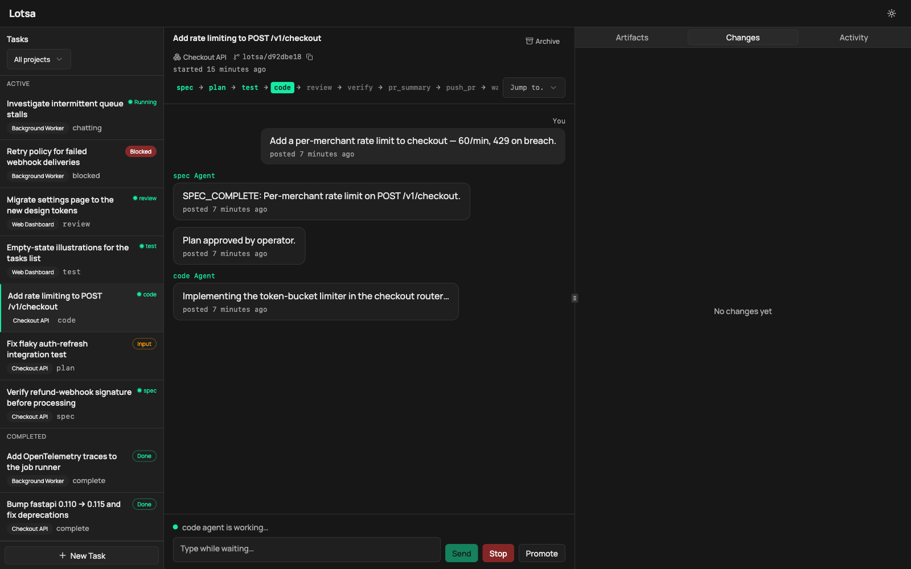

# Lotsa

**Describe a task, walk away, come back to a PR that followed your rules.**

<p align="center">
  
</p>

Lotsa is a self-hosted runner and dashboard that takes coding tasks from idea to PR — driving an AI coding agent (Claude Code) through a structured pipeline you define, across all your repositories, in parallel, while you supervise by exception.

It's a **complement** to the AI tools you already use, not a replacement. Your chat assistant and in-editor copilot are great at interactive, hands-on coding. Lotsa is the layer above: it takes a whole, well-defined task and runs it to completion on your own infrastructure — so you can hand off the work that doesn't need you watching, and spend your attention where it actually counts.

**Scope it in chat. Walk away while it runs. Come back to verify.** Sync where your judgment counts, async where it doesn't.

> **tasks**, not chats · **servers**, not terminals · **closed-loop**, not open-loop · **a fleet**, not a single agent · **a pipeline**, not freeform

## Your rules, enforced by the system — not the model's memory

A capable coding model will *usually* follow the rules you give it: write the tests first, run the linter, get the diff reviewed by fresh eyes, never push straight to `main`. But "usually" isn't a process. Over a long task, models forget steps, skip checks, and drift from the conventions you laid out.

Lotsa makes the process **structural**. You define the pipeline — the steps, the gates, the routing — and the orchestrator runs it the same way every time, whichever model is behind it:

- **Tests get written. The diff gets reviewed** by a fresh agent with no implementation bias. **The build gets verified** before a PR opens. These aren't lines in a prompt the model might honour — they're steps the system executes, in order, every time, collecting proof as it goes.
- **Git stays safe.** Agents only edit and commit inside an isolated per-task worktree; branching, pushing, and PR creation are deterministic and operator-owned — never the agent's.
- **Humans gate what matters.** Approve the plan before any code is written; let everything else run unattended.

And the pipeline is yours to shape — the steps, gates, and routing live in a `process.yaml` you control (start from the bundled `chat` / `standard` / `full` flows, or write your own). The rules Lotsa enforces are the ones *you* wrote down.

The point: your rules are enforced by the orchestration layer, not by the model remembering them — so task #100 gets the same rigor as task #1.

**This is closing the loop.** Reliable agent work is a feedback system with two halves: *verification* — the objective checks the system runs (tests, a fresh-agent diff review, a verified build) — and a *heartbeat* — the orchestrator advancing state and deciding what runs next. Most agent setups are open-loop: they generate, and the loop only closes when you're watching. Lotsa puts the loop in the process, so it closes whether you're at the keyboard or not. ([The thinking behind it →](https://andrewcrookston.com/articles/close-the-loop.html))

## What it does

Three beats: **scope it in chat, let it run, verify the result.** Everything below serves that loop.

- **Runs tasks end to end.** Hand Lotsa a task and it drives your flow — chat → spec → plan → *(your approval)* → tests → code → review → verify → PR — dispatching the agent at each step.
- **Starts as a conversation.** Every task opens in **chat**: talk the work through, then **promote** it into a structured process when you know what you want. Pick the depth per task.
- **Owns git safely, follows the PR to merge.** Deterministic, orchestrator-owned commits and pushes. Lotsa opens the PR and keeps watching it — when a reviewer or CI leaves actionable feedback, it dispatches a fix, pushes again, and re-runs its own review, automatically, until the PR is merged. You're not the one ferrying review comments back to an agent.
- **Leaves a trail.** Every dispatch, routing decision, and artifact is recorded in the local SQLite store — the full event history of each task, so you can always see *why* it did what it did.
- **Runs a fleet.** Many tasks at once, across many repos, from one dashboard you leave running. The work continues whether you're at the keyboard or not.
- **Model-agnostic.** Claude out of the box; route individual steps to different providers (OpenAI-shaped CLIs, local models). The orchestration layer just runs the right tool for the job — and records which one ran each step.
- **Self-hosted and private.** Local SQLite, no telemetry, no external database; the only outbound call is the LLM endpoint you configure. EU-friendly by design.

## Where Lotsa fits

Lotsa doesn't replace the tools you code with — use it *alongside* them. Reach for Claude Code or Codex when you want to be in the loop; reach for Lotsa when you want to step out of it:

- **enforced rules** — your conventions run as steps, every task, not when the model remembers them
- **quality you can trust** — tests written, the diff reviewed by a *fresh* agent, the build verified before any PR opens
- **to close your laptop** — kick it off, walk away, come back to an open pull request
- **to run a fleet** — many tasks at once, across every repo you own
- **the PR handled to merge** — it watches the PR and fixes review/CI feedback for you
- **a person in the loop only where it counts** — a gate exactly where you want one, and nowhere you don't
- **on your own terms** — your machine, your keys; nothing routes through anyone

*"I keep Claude Code open for hands-on work, and hand Lotsa the tasks I want run to a standard without babysitting. Use the right one for the moment."*

## A task, start to finish

Say you want to add rate limiting to an API endpoint:

1. **Open a task in chat** and talk it through — the endpoint, the limits, the edge cases — until you're aligned. Then **promote** it to the `full` process.
2. **Spec → Plan.** The agent reads the repo, writes a spec, cuts a fresh branch, and drafts an implementation plan — then stops at a gate.
3. **You approve the plan** (or send it back) from the dashboard. That's the one decision that needs you.
4. **Test → Code → Review → Verify** run unattended: failing tests first, code to make them pass, a *fresh* agent reviews the diff with no implementation bias, and the build is verified.
5. **Lotsa opens the PR** and keeps watching it — when CI or a reviewer leaves actionable feedback, it dispatches a fix and pushes again.

You spent thirty seconds approving a plan. Meanwhile three other tasks ran the same way, in other repos, in parallel.

## Who it's for

Solo developers and small teams who want to put AI coding agents on real work — with an enforced process, human gates where they matter, and full control over their code and infrastructure. If you already live in Claude Code or Codex and want to hand off the well-defined tasks without giving up your conventions, Lotsa is for you.

> **Status:** early and actively developed — pre-1.0, so expect rough edges and occasional breaking changes to config and schema. Issues and feedback are very welcome.

## Quick start

**Requires:** Python 3.12+ and the [Claude Code CLI](https://docs.anthropic.com/en/docs/claude-code). (Node.js is only needed to install *from source* — the released wheel bundles the dashboard.)

```bash
# 1. Install Lotsa — the wheel bundles the dashboard
pipx install lotsa          # recommended: isolated CLI install
# or:  pip install lotsa

# 2. Scaffold a Lotsa directory (defaults to ~/.lotsa)
lotsa init

# 3. Provide credentials and start the dashboard
export ANTHROPIC_API_KEY=sk-ant-...   # or run `claude setup-token` for CLAUDE_CODE_OAUTH_TOKEN
export GITHUB_TOKEN=ghp_...           # enables push + pull-request features
lotsa serve
```

**From source (development):** clone the repo and run `make setup` instead of step 1 — that builds the dashboard (needs Node.js) and installs in editable mode. See [Development](#development).

`lotsa serve` runs a startup preflight (ADR-036) and refuses to start if a prerequisite is missing — run `lotsa doctor` any time to see the same report without starting the server. A missing `GITHUB_TOKEN` prompts for confirmation (push/PR features disabled); pass `--yes` (or set `LOTSA_ASSUME_YES=1`) to pre-acknowledge it for headless/CI starts.

(Re-run `make frontend` after editing anything under `lotsa/frontend/`.)

`lotsa serve` opens the dashboard in your browser. Create tasks, watch each flow step execute, approve gated steps, and review output — all from the web UI.

## How it works

1. You create **tasks** in the dashboard. Each opens in **chat** by default — a conversation you grow from — then you **promote** it into a structured process (see [Processes](#processes) below).
2. Once a task is in a structured process, the orchestrator drives it step by step: it dispatches Claude Code, routes on each step's output, and advances to the next.
3. Task state and full event history are persisted in a local SQLite database.

Everything Lotsa owns lives in one directory (`--data-dir`, default `~/.lotsa`):

```
~/.lotsa/
  lotsa.yaml               ← config (created by `lotsa init`)
  lotsa.db                 ← SQLite store (tasks + messages + events)
  worktrees/               ← per-task git worktrees (namespaced per project)
```

### State machine

States depend on the task's process (see [Processes](#processes) below).

- **backlog** — waiting to be picked up
- **coding** — agent is working on it
- **complete** — agent finished successfully
- **blocked** — agent failed, needs human attention

## Processes

A **process** is the full job catalog — every step a task can take, plus the flows that string them together. Lotsa ships five bundled processes; you can also define your own inline in `lotsa.yaml` or as standalone `process.yaml` files.

New tasks default to `chat` (ADR-034): a fresh `lotsa serve` opens a task as a conversation you grow from, then **promote** into a structured process (`full`, `quickfix`, …) when you know what you're building. The whole bundled catalog plus every inline process is always loaded, so each one is pickable per-task in the new-task picker and a valid promotion target — `--process <name>` / `--flow <name>` (or `lotsa.yaml`'s `flow:` field, or an inline entry's `default: true`) only chooses **which process the picker pre-selects** as the default. Pass `--flow full` to make full the default for an operator who always builds; drop the flag for chat-first.

### Bundled processes

#### `chat` (default) — explore and triage

```
backlog → chatting (conversational) → promote into another process
```

A single conversational step, no completion marker and no commit pressure. New tasks start here out of the box: discuss the work with the agent, and when you're ready, **promote** the task into a structured process (`full`, `quickfix`, `standard`, `simple`) — the worktree and history carry over. This is the zero-config default.

#### `simple` — implement only

```
backlog → coding → complete | blocked
```

Agent implements the task directly in the working directory. No branching, no committing. Good for quick scripts or learning.

#### `standard` — branch, implement, commit

```
backlog → coding → complete | blocked
```

Agent creates a feature branch, implements the task, runs validation (lint/test), commits, and reports a summary. A good middle ground for real development work — select it per task in the new-task picker, or make it the picker's default with `--flow standard`.

#### `full` — spec, plan, test, code, review, verify, PR loop

```
backlog → speccing → planning → planned (human gate) → testing → coding → reviewing → verifying → push_pr → wait_for_pr_signal → complete | blocked
```

Six agent-dispatched steps plus a human gate and an automated PR-monitoring phase:

1. **Spec** — conversational; agent and operator iterate on the task description until the agent emits `SPEC_COMPLETE: <title>`. The resulting spec is persisted as a `spec` artifact for downstream steps to consume
2. **Plan** — agent reads codebase, creates feature branch, writes implementation plan
3. **Approve** — human reviews the plan in the dashboard and approves it
4. **Test** — agent writes failing tests (resumes same session)
5. **Code** — agent implements to make tests pass (resumes same session)
6. **Review** — agent reviews the diff independently (fresh session, no implementation bias)
7. **Verify** — conversational; agent walks through what was built and confirms it matches the spec before opening the PR
8. **Push & monitor** — the `push_pr` action job opens the PR, then the `wait_for_pr_signal` monitor polls GitHub. Reviewer comments and failing checks dispatch a `pr_fix` sub-flow that re-runs review and pushes again until merged

The `planned` state is a **human gate** — no dispatch rule targets it. The task waits in the dashboard until you approve or reject it.

#### `quickfix` — execute a precise instruction

```
backlog → coding → reviewing → complete | blocked
```

For a mechanical change you've already decided on (status bumps, typo fixes, renames, config/dependency tweaks): the coder executes the instruction directly — no spec, no plan, no test-writing — and review checks the diff against that instruction. A common promotion target from `chat` when the conversation lands on a small, well-defined edit.

### Custom processes

Two ways to define your own:

#### Inline in `lotsa.yaml` (agent-only sequences)

Best for non-engineering processes (research, content review, anything that's just a sequence of agent calls). Each entry under `processes:` is its own process, named by its key:

```yaml
# lotsa.yaml
processes:
  marketing_research:
    default: true                    # makes this the picker's default selection
    prompts_dir: ./prompts/mkt       # optional; relative to lotsa.yaml
    steps:
      - { name: research, prompt: research }
      - { name: synthesize, prompt: synthesize }

  support_triage:
    prompts_dir: ./prompts/support
    steps:
      - name: triage
        prompt: triage
        rules:
          - { source: stdout, pattern: ESCALATE, target: blocked }
```

Each step is an agent job. Step prompts load from `<basename>-system.md` and `<basename>-user.md` under the per-process `prompts_dir` (defaults to `./prompts`).

Run with `lotsa serve --process marketing_research` (or omit when `default: true` is set).

#### Standalone `process.yaml` (typed jobs + sub-flows)

For complex processes that need action jobs (run a tool), monitor jobs (poll an external source), or sub-flows (named pipelines invoked by monitors). Load via `--flow-file=<path>`.

```yaml
# my-process.yaml
process: my_process
jobs:
  - name: plan
    type: agent
    prompt: planning
    evaluate: true                   # human gate; queues until approved

  - name: code
    type: agent
    prompt: coding
    resume: true                     # reuse Claude session from previous step
    rules:
      - { source: stdout, pattern: "FAILED", target: plan }
      - { source: stdout, pattern: "passed", target: next }

  - name: review                     # also referenced from the pr_fix sub-flow
    type: agent
    prompt: review

  - name: pr-fix                     # invoked by the monitor on PR feedback
    type: agent
    prompt: pr-fix

  - name: push_pr
    type: action
    tool: push_pr                    # opens a GitHub PR

  - name: wait
    type: monitor
    engine: pr_monitor               # polls the PR for signals
    config:
      poll_interval_seconds: 30
      max_pr_fix_rounds: 10

flows:
  main:
    steps: [plan, code, review, push_pr, wait]

  pr_fix:                            # sub-flow the monitor dispatches into
    steps:
      - name: pr-fix
        rules:
          - { source: stdout, pattern: "PR_FIX_SKIPPED", target: wait }
      - name: review                 # the per-flow rules below override main's
        rules:
          - { source: stdout, pattern: "Critical|High", target: pr-fix }
          - { source: stdout, pattern: "LGTM", target: push_pr }
      - push_pr
```

Every job referenced from a `flows:` block (including sub-flows) must exist at the top-level `jobs:` list. Per-flow `rules:` overrides under a step entry shadow the job's default rules for that flow only — useful when a job like `review` participates in two flows with different routing.

**Job fields** (common to all types):

| Field | Default | Description |
|-------|---------|-------------|
| `name` | *(required)* | Job name — used for files, display, event logs |
| `type` | `agent` | One of `agent`, `action`, `monitor` |
| `config` | `{}` | Tool/engine-specific config; merged with per-flow binding overrides |

**Agent fields:**

| Field | Default | Description |
|-------|---------|-------------|
| `prompt` | same as `name` | Prompt file prefix — loads `{prompt}-system.md` and `{prompt}-user.md` |
| `resume` | `false` | Resume from stored session ID |
| `evaluate` | `false` | Human gate — item waits for approval before advancing |
| `rules` | `[]` | Output-based routing rules (see below) |
| `conversational` | `false` | Chat-style iterative step |
| `output` | `null` | Artifact name this step produces |
| `inputs` | `[]` | Artifact names this step requires before dispatch |

**Action fields:** `tool: <name>` references a tool registered via `lotsa.registry.register_tool` (built-in: `push_pr`; or extend via `tools:` block, below).

**Monitor fields:** `engine: <name>` references an engine registered via `lotsa.registry.register_engine` (built-in: `pr_monitor`; or extend via `engines:` block, below).

**Output rules** match against agent output after completion. Rules are evaluated in order — first match wins:

| Field | Description |
|-------|-------------|
| `source` | `"stdout"` or a file path relative to the task's worktree (e.g. `.lotsa/plan.md`) |
| `pattern` | Regex to search for in the source content |
| `target` | `"next"` (default), `"blocked"`, or a job name to route to |

The bundled processes live at `lotsa/prompts/{name}/process.yaml`.

### Extending with tools and engines

Action and monitor jobs reference named tools and engines from a registry. Built-ins (`push_pr` tool, `pr_monitor` engine) are always available; register your own via `lotsa.yaml`:

```yaml
# lotsa.yaml
tools:
  notify_slack: my_package.tools:notify_slack       # action tool
engines:
  jira_monitor: my_package.engines:JiraMonitorEngine # monitor engine
```

Each value is `"dotted.module:callable_or_class"`. Tools are async callables `(TaskContext, config) -> ToolResult`. Engines are classes with `__init__(orchestrator, monitor_state, config)` plus `run()`, `untrack()`, and `snapshot_triggering_ids()` methods. See `lotsa/tools/push_pr.py` and `lotsa/engines/pr_monitor.py` for reference implementations.

### Multi-provider runners (ADR-023)

By default every model name dispatches through the built-in `ClaudeCodeRunner` (the `claude` CLI). To route some model names to a different agent runner — an OpenAI-shaped CLI, a local LiteLLM runner, etc. — register them under a `runners:` block. The built-in runner is always the default and handles `claude-*` / `sonnet` / `opus` / `haiku`, so existing configs need no entry.

```yaml
# lotsa.yaml — multi-provider is a sample, not the default. Leave this out for
# single-provider (Claude-only) setups; the bundled processes ship unchanged.
runners:
  gpt:
    handler: lotsa_runners.codex:CodexCliRunner
    prefixes: [gpt-, openai/]     # routes gpt-5, gpt-4.1, openai/o1, …
  local:
    handler: lotsa_runners.litellm_runner:LiteLLMRunner
    prefixes: [ollama:, llama-]
```

A model name resolves to a runner by: exact name → longest matching prefix → default. The handler class is constructed with `model` / `budget_usd` / `max_output_tokens` from config, so third-party runner constructors must accept those keyword arguments (the `ClaudeCodeRunner` signature is the contract). The audit trail records `agent_runner` (the registered name, e.g. `gpt`) alongside `agent_model`.

> Note: Lotsa does not ship any third-party runners — `runners:` only wires up runners you provide. Per-step model routing (a different runner per process step) is live: a job's per-step `model:` (ADR-022) selects the runner for that step, falling back to the global `model:` when a job sets none.

## Configuration

Settings can come from a config file, CLI flags, or both. CLI flags always win.

### Config file (`lotsa.yaml`)

Lives at `~/.lotsa/lotsa.yaml` by default (alongside `lotsa.db` and the per-task worktrees). `lotsa init [data_dir]` scaffolds one; `--data-dir <path>` and `--config <path>` override the location for one-off runs.

```yaml
# ~/.lotsa/lotsa.yaml
model: sonnet                 # claude model
budget: 5.0                   # max USD per agent run
# max_output_tokens: 128000   # cap per response — uncomment to raise the 32000 default
flow: chat                    # default-selected process: bundled name (chat/simple/standard/full/quickfix) or an inline process name. The full catalog always loads; this only sets the picker's pre-selected default
prompts_dir: prompts/         # custom prompt templates (optional)

# Projects — the git repos Lotsa can run tasks against. Each id must match
# [a-z0-9_-] and point at an existing git repository. The new-task picker and
# the sidebar project filter list these; a single project is shown without a
# picker. (~ is expanded.)
projects:
  lotsa:
    name: Lotsa
    path: /path/to/your/repo
  # myapp:
  #   name: My App
  #   path: ~/code/myapp

# work_dir: /path/to/your/repo  # DEPRECATED (ADR-029) — seeds a single
#                               # `default` project. Prefer `projects:` above.

# Optional — register custom action tools and monitor engines
# referenced from a process. Built-ins (push_pr, pr_monitor) are
# always available; only list third-party additions here.
tools:
  my_tool: my_package.tools:my_tool
engines:
  my_engine: my_package.engines:MyEngineClass

# Optional — define agent-only processes inline. See "Custom processes"
# above for the schema. Each entry is its own selectable process.
processes:
  marketing_research:
    default: true
    prompts_dir: ./prompts/mkt
    steps:
      - { name: research, prompt: research }
      - { name: synthesize, prompt: synthesize }
```

All fields are optional — missing fields use defaults. `lotsa init` writes a starter `lotsa.yaml` with the optional blocks commented out.

### Projects (multi-repo)

Lotsa can drive tasks across several repos (ADR-029). Register each under `projects:` (see the example above): the `id` is a path/DB key (`[a-z0-9_-]`), `path` must be an existing git repository, and `name` is the display label. Restart `lotsa serve` after editing.

When you create a task, a **project picker** offers the registered repos (it remembers your last choice); the sidebar gains a per-project filter and badges. With only **one** project registered, those controls are hidden as noise — so if you "can't select a project," it means only one is registered. Add more to `projects:` to get the picker.

`work_dir:` is the deprecated single-project predecessor: it seeds one `default` project from that path. It still works, but prefer `projects:`. Note: keeping `work_dir:` *and* a `projects:` block registers a surprise extra `default` unless you declare `projects: default:` yourself — so once you migrate, remove `work_dir:`.

### Resolution order

1. CLI flags (highest priority)
2. `lotsa.yaml` config file
3. Built-in defaults

```bash
# Everything from config (reads ~/.lotsa/lotsa.yaml)
lotsa serve

# Override model from config
lotsa serve --model opus

# Override budget
lotsa serve --budget 10.0

# Use a portable project-local Lotsa directory
lotsa serve --data-dir ./lotsa-data

# Explicit config file (skip discovery)
lotsa serve --config /path/to/lotsa.yaml
```

## CLI reference

### `lotsa init [data_dir]`

Create a Lotsa directory with a config file. `data_dir` defaults to `~/.lotsa` — the single directory that holds `lotsa.yaml`, `lotsa.db`, and per-task worktrees.

```bash
lotsa init                          # creates ~/.lotsa/
lotsa init ./lotsa-data             # portable project-local data dir
```

Creates `lotsa.yaml` in the data directory. Idempotent — won't overwrite an existing `lotsa.yaml`.

### `lotsa serve`

Start the dashboard. Reads `lotsa.yaml` from `--data-dir` (default `~/.lotsa`). Uvicorn logs the bind URL on startup — open it in your browser. Errors out with a "run lotsa init" hint if no config is found.

```bash
lotsa serve                                # dashboard on 127.0.0.1:8420 (chat-first)
lotsa serve --flow full                    # pre-select the full process in the picker
lotsa serve --process marketing            # pre-select an inline process from lotsa.yaml
lotsa serve --flow-file my.yaml            # use a standalone process.yaml
lotsa serve --model opus                   # use a specific model
lotsa serve --budget 10.0                  # set budget per run
lotsa serve --prompts-dir prompts/         # custom prompt templates
lotsa serve --docker                       # run agents in Docker containers
lotsa serve --runner claude-agent-sdk      # use the SDK-shaped runner (experimental, ADR-028)
lotsa serve --port 9000                    # custom port
lotsa serve --data-dir ./lotsa-data        # portable project-local data dir
lotsa serve --config /path/lotsa.yaml      # explicit config file
```

| Flag | Default | Description |
|------|---------|-------------|
| `--flow` | `chat` | Process the new-task picker pre-selects by default — a bundled name (`chat`/`simple`/`standard`/`full`/`quickfix`) or any inline name. The full catalog always loads; this only sets the default, it doesn't restrict what's available. |
| `--process` | — | Alias for `--flow`; either works |
| `--flow-file` | — | Standalone `process.yaml` file (highest priority — overrides `--flow`/`--process` and inline `default: true`) |
| `--model` | `sonnet` | Claude model name |
| `--budget` | `5.0` | Max USD per agent run |
| `--max-output-tokens` | — | Cap on tokens Claude Code may emit per response. Overrides the default 32000 ceiling that produces `"Claude's response exceeded the 32000 output token maximum"` errors. Unset inherits `$CLAUDE_CODE_MAX_OUTPUT_TOKENS` from the shell. |
| `--work-dir` | `.` | **Deprecated** (ADR-029) — seeds a single `default` project from this path. Prefer a `projects:` block in `lotsa.yaml`. |
| `--prompts-dir` | — | Directory with custom prompt templates |
| `--docker` | off | Run agent inside a Docker container. Requires the agent image (`lotsa build`) **and** an env credential — `ANTHROPIC_API_KEY` or `CLAUDE_CODE_OAUTH_TOKEN`; `claude login` keychain auth isn't visible inside the container. The startup preflight checks both. |
| `--docker-image` | `lotsa-agent:latest` | Docker image to use |
| `--runner` | — | Agent runner shape. Unset uses the default CLI runner (or Docker when `--docker` is set). Set `claude-agent-sdk` for the experimental SDK runner (ADR-028) — overrides `--docker` when both are given. See [Agent runners](#agent-runners). |
| `--data-dir` | `~/.lotsa` | Where Lotsa stores its data |
| `--host` | `127.0.0.1` | Bind address |
| `--port` | `8420` | Dashboard port |
| `--config` | auto-discovered | Explicit path to `lotsa.yaml` |
| `--yes` / `-y` | off | Pre-acknowledge startup CONFIRM prompts (e.g. missing `GITHUB_TOKEN`). Also via `LOTSA_ASSUME_YES=1`. Needed for headless/CI starts. |

### `lotsa doctor`

Run the first-run preflight checks and report problems without starting the server (ADR-036). `lotsa serve` gates on the same checks at startup. Exits non-zero if any blocking (FATAL) check fails, so it doubles as a CI/healthcheck probe.

```bash
lotsa doctor                        # check the default ~/.lotsa config
lotsa doctor --data-dir ./lotsa-data
```

Checks: the `claude` CLI is on PATH, agent credentials are configured, a project resolves to a git repo, the dashboard bundle is present/buildable, `GITHUB_TOKEN` is set (push/PR features), and a git author identity is set. In docker mode (`--docker` / `docker: true`) it also checks the Docker daemon is up and the agent image exists (build it with `lotsa build`).

### `lotsa build`

Build the Docker image for sandboxed agent execution. **Run this before
`lotsa serve --docker`** — without it, the agent dispatch fails when `docker run`
can't find the image (the startup preflight catches this and points you here).

```bash
lotsa build                    # builds lotsa-agent:latest
lotsa build --tag my-image:v1  # custom tag
```

### Environment variables

| Variable | Required | Description |
|----------|----------|-------------|
| `ANTHROPIC_API_KEY` | one of these | API key for Claude |
| `CLAUDE_CODE_OAUTH_TOKEN` | one of these | OAuth token (Claude Pro/Team/Enterprise) |
| `CLAUDE_ACCOUNT_UUID` | with OAuth | Account UUID for OAuth auth |
| `CLAUDE_ORG_UUID` | with OAuth | Organization UUID for OAuth auth |

Set either `ANTHROPIC_API_KEY` *or* the `CLAUDE_CODE_OAUTH_TOKEN` group.

**Getting a `CLAUDE_CODE_OAUTH_TOKEN`** (uses your Claude Pro/Max subscription instead of API billing):

```bash
claude setup-token                 # opens a browser, prints a long-lived token
export CLAUDE_CODE_OAUTH_TOKEN=<the-token-it-printed>
```

This is the headless/CI-friendly credential and the one to use for **Docker mode** — a container can't see the keychain session that `claude login` creates, so it needs `CLAUDE_CODE_OAUTH_TOKEN` (or `ANTHROPIC_API_KEY`) in the environment. Treat it like a password; don't commit it.

## Docker mode

Run agents inside a Docker container for sandboxed execution. The container has Claude Code CLI, Node.js, and git pre-installed.

### Setup

```bash
# Build the agent image (one-time)
lotsa build

# Provide an env credential — keychain (`claude login`) can't cross into the
# container. Use a subscription OAuth token (`claude setup-token`) or an API key.
export CLAUDE_CODE_OAUTH_TOKEN=...   # or: export ANTHROPIC_API_KEY=sk-ant-...

# Start the dashboard with Docker enabled
lotsa serve --docker
```

### How it works

When `--docker` is set, Lotsa runs `docker run` instead of calling `claude` directly:
- The task's worktree is mounted as a volume at `/workspace` inside the container
- Claude auth credentials are forwarded as environment variables
- The container is removed after each run (`--rm`)

### Config file

```yaml
# lotsa.yaml
docker: true
docker_image: lotsa-agent:latest  # or your custom image
```

### Custom Docker args

For advanced use (network access, memory limits), use `DockerAgentRunner` directly in Python:

```python
from lotsa.docker_runner import DockerAgentRunner

runner = DockerAgentRunner(
    docker_args=["--network", "host", "--memory", "4g"],
)
```

## Agent runners

Lotsa dispatches each agent through a **runner**. Two runner *shapes* ship today:

- **CLI runner** (default) — drives the `claude` CLI as a one-shot
  `claude --print` subprocess. This is what you get with no `--runner` flag
  (and what `--docker` wraps in a container). Battle-tested; it backs every
  bundled process.
- **SDK runner** (`--runner claude-agent-sdk`, **experimental**) — drives
  Anthropic's [`claude-agent-sdk`](https://pypi.org/project/claude-agent-sdk/)
  programmatically instead of shelling out to `claude --print`. Introduced by
  [ADR-028](docs/adr/ADR-028-claude-agent-sdk-runner.md).

### SDK runner — what's wired, and the gaps

The SDK runner ships ADR-028 Phases 1, 2 & 3. Know these limits before
selecting it:

- **Not a pure-API / CLI-free runner.** `claude-agent-sdk` is not a thin HTTP
  client for `/v1/messages`; it drives the Claude Code CLI/Node runtime under
  the hood. Selecting it does **not** remove the Claude Code runtime
  requirement, and it does **not** reduce the self-hostable footprint versus
  the CLI runner. A genuinely CLI-free pure-API shape is a separate, unbuilt
  runner (the *API shape* in ADR-023).
- **Auth model is simpler.** It reads `ANTHROPIC_API_KEY` programmatically
  (and honours `ANTHROPIC_BASE_URL` for an enterprise-hosted proxy), with no
  keychain and no `--dangerously-skip-permissions` flag. `ANTHROPIC_API_KEY`
  is required when this runner is selected. Note this is an *auth*
  simplification, not a tighter *permission* posture: the runner sets
  `permission_mode="bypassPermissions"`, the SDK-equivalent of the CLI
  runner's `--dangerously-skip-permissions` (both bypass all permission
  prompts), which is required for headless operation. Real per-tool gating
  lands with the interception follow-up ADR.
- **Single-turn, no tool-interception surface yet.** The Lotsa-owned
  cross-turn lifecycle — dashboard-resolved `AskUserQuestion`, background
  `Bash`, subagent dispatch, `Monitor`/`ScheduleWakeup` via SDK resume — is
  **not** built in this cut. The runner therefore advertises only the
  capability it actually wires (programmatic, single-turn).
- **Per-step `runner:` field (Phase 3).** In addition to the global
  `--runner` flag, individual jobs in `process.yaml` can name a runner
  explicitly:
  ```yaml
  - name: code
    type: agent
    prompt: coding
    model: sonnet
    runner: claude-agent-sdk   # opt in for this step only
  ```
  The named runner must be registered (built-in `claude-agent-sdk`, or an
  operator entry in `lotsa.yaml`'s `runners:` block). A miss at
  `build_process` time raises a `ValueError` listing the registered names.
  Steps without `runner:` continue to resolve via `model:` as before.
- **`--budget` is not enforced yet.** The CLI runner caps per-run spend via
  `claude --print --max-budget-usd`; this cut wires no equivalent into the
  SDK (`claude-agent-sdk` exposes no USD ceiling), so `--budget` is advisory
  only for the SDK runner — surfaced in the run log but not capped. Bound SDK
  runs another way (e.g. `timeout_seconds`) until a cap lands.

The `claude-agent-sdk` dependency is install-time only and imported lazily, so
operators who don't select the SDK runner incur no runtime cost from it.

## Custom prompts

By default, Lotsa uses a generic coding prompt. For better results, create custom prompts:

```bash
mkdir prompts
```

```markdown
# prompts/coding-system.md
You are a senior Python developer working on the Acme project.
Follow PEP 8, write tests for all new code, and use type hints.
```

```markdown
# prompts/coding-user.md
Implement the following task. Write clean, well-tested code.
```

Then start the dashboard with:

```bash
lotsa serve --prompts-dir prompts/
```

The task title and body are appended to the user prompt automatically.

## Architecture (for contributors)

Lotsa is the product you run: the CLI, config, the local SQLite store, the
dashboard, the orchestrator, the push step, and the PR monitor. The reusable
orchestration core — state machine, dispatch engine, agent runners, git
utilities — lives in an internal package, `rigg/`, which Lotsa wires up by
supplying three implementations:

| Interface     | Lotsa implementation | What it does |
|---------------|----------------------|--------------|
| item source   | `SQLiteItemSource`   | Reads tasks from the local SQLite store |
| notifier      | `ConsoleNotifier`    | Surfaces blocking reasons |
| agent runner  | `ClaudeCodeRunner`   | Runs the Claude Code CLI |

You rarely need to touch `rigg/` to build *with* Lotsa — it's the inner
machinery (documented in `rigg/CLAUDE.md`).

## Example

```bash
# Scaffold a tasks directory and start the dashboard
lotsa init
lotsa serve
```

Then open the dashboard in your browser and create your first task.

## Development

```bash
# Run lotsa tests
python -m pytest lotsa/tests/ -v

# Run all tests (rigg + lotsa)
python -m pytest rigg/tests/ lotsa/tests/ -v

# Lint
ruff check lotsa/
ruff format --check lotsa/
```

## Contributing

Issues and pull requests are welcome. Before submitting, skim [CONSTITUTION.md](CONSTITUTION.md) (the non-negotiable rules) and the per-directory `CLAUDE.md` files (how each area is organised) — they're the same conventions the project's own CI reviewer checks against.

## License

[Apache-2.0](LICENSE).
